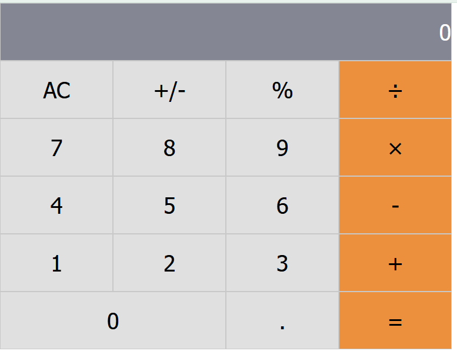

# Math Magicians

> "Math magicians" is a website for all fans of mathematics. 

It is a Single Page App (SPA) that allows users to:

Make simple calculations.
Read a random math-related quote.

## Built With

- CSS
- React
- Javascript

## Live Demo

[Live Demo Link](https://oliverscz.github.io/Math-Magicians/)

## Getting Started
To get a local copy up and running follow the instructions.

## Setup
Open the terminal and clone the project using git clone git@github.com:fabianofrank/pokemon-api.git

## Install
cd into the project folder and run npm install
Run the command npm start
## Usage
In progress
## Run tests
Run the command npm test

## Authors

👤 **Author**

- GitHub: [@oliverSCZ](https://github.com/oliverSCZ)
- Twitter: [@olivercoimbra](https://twitter.com/olivercoimbra)
- LinkedIn: [olivercoimbra](https://linkedin.com/in/olivercoimbra)

## 🤝 Contributing

Contributions, issues, and feature requests are welcome!

Feel free to check the [issues page](../../issues/).

## Show your support

Give a ⭐️ if you like this project!

## 📝 License

This project is [MIT](./MIT.md) licensed.
